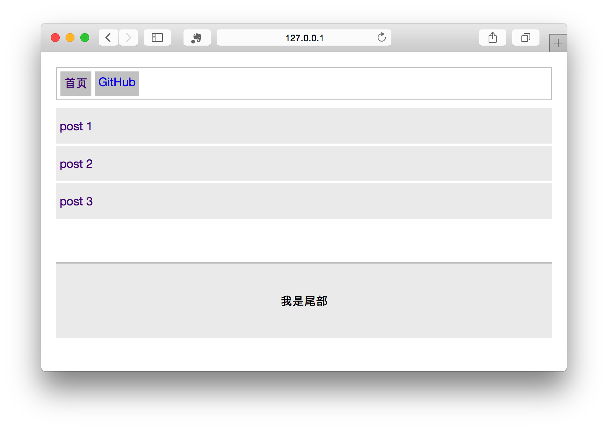

## 起步

### 开始前的说明

在开始介绍之前我不得不着重强调一下，fis3-smarty 已经依赖了所有需要的插件，默认[技术选型](#技术选型)下你不需要安装其他任何 fis 插件。

#### 技术选型

- js 模块化使用 **commonJS** 规范，模块框架 `mod.js`
- less 支持
- 前端模板选用 baiduTemplate 或 utc (underscore.js)

### 安装使用

通过 [README.md](../README.md) 可得知其使用方法

### 一个简单的例子

```
/demo/common
/demo/subsiteA
/demo/subsiteB
```

构造一个例子，其中包含三个模块，每一个模块对应是一个 FIS3 的项目。每一个模块对应一个 SVN 仓库。

> 业务小时，可以只包含一个模块；这三个模块也可以放到一个 SVN 仓库中。
>> 假设版本管理工具选择的是 SVN，当然也可以是 GIT 或其他，下同。


- common 模块包含公用的一些 widget 或 layout 以及可能的一些测试数据
- subsite* 子站模块
    
    > 当站点包含的代码量很大时，就需要考虑拆成子站来单独维护，这样互相上线不会受到干扰，而且也减轻了 SVN merge 的出错几率。

    举个例子，假设 [知道](https://zhidao.baidu.com) 站点，首页为一个模块、分类页作为一个模块、问题页作为一个模块等。


#### 目录结构

每一个模块的目录结构如下；

```
├── fis-conf.js
├── page
├── plugin
├── static
├── server.conf
├── smarty.conf
├── test
└── widget
```

|目录文件|解释|作用范围|
|:------|:---------|:-----------------|
|widget| 放一些 widget，里面代码最终会被组件化封装，需要 require 才能执行|逻辑代码，最终上线|
|page|   放一些页面，子站可能有多个页面|逻辑代码，最终上线|
|plugin| 有一些 Smarty 的插件放入这个目录，当然一般只需要一个模块拥有即可，比如 common|逻辑代码，最终上线|
|static|非组件静态资源|逻辑代码，最终上线|
|test|   测试数据，放一些模拟数据|本地模拟测试使用|
|server.conf  |本地测试的 URL 转发规则配置文件| 本地模拟测试使用|
|smarty.conf     |本地测试的 Smarty 引擎的配置文件，common 模块包含即可|本地模拟测试使用|
|fis-conf.js     |fis3 的配置文件| fis3 构建工具使用 |
|build.sh| 上线编译机执行脚本（baidu 产品需要）| 编译机使用 |

*以上目录文件不是都必须需要，一般都会包含page、widget俩目录*

可能从目录结构文件中有一半是提供给本地模拟环境的，所以请不要跟上线文件**搞混**

说完了构造的目录结构，我们开始构造一个应用。

*common*
```
/fis-conf.js
/page/layout.tpl
/plugin
/server.conf
/smarty.conf
/static/layout.less
/static/mod.js
/static/reset.css
/widget/footer
/widget/header
```
- `common/plugin` 一些 FIS 提供的 Smarty 插件或者你自定义的一些 Smarty 插件，可以在[此处下载](https://github.com/fex-team/fis-plus-smarty-plugin)
- `mod.js` FIS 提供的轻量级 JS 模块化框架，简单易用，后续会有章节介绍，你可以在 [/fex-team/mod](https://github.com/fex-team/mod) 找到它

*subsiteA*
```
/fis-conf.js
/page/index.tpl
/server.conf
/test/page/index.php
/widget/post-list
/widget/post-list-item
```

*subsiteB*
```
/fis-conf.js
/page/index.tpl
/server.conf
/test/page/index.php
/widget/post
```

**例子下载** [site.zip](https://github.com/fex-team/fis3-smarty/blob/master/doc/demo/size.zip?raw=true)

### 构建

假定你已经看过 FIS3 的相关文档（http://fis.baidu.com)。

首先下载 demo，然后解压，进入这个目录，执行以下命令对所有模块进行构建发布。

```
fis3 release -r common
fis3 release -r subsiteA
fis3 release -r subsiteB
```

可能有人会问，能否一条命令就构建三个模块，在此处明确说明这是不能的，至少暂时不支持。

### 预览

首先保证你安装了本地**测试模拟环境**套件，如果你忘了安装，按照一下命令安装。

```
fis3 server install server-env
```

启动本地测试服务进行预览，本地测试服务依赖

- java >= 1.6.0
- php-cgi >= 5.2.17

> 这块注意，很多 Mac 使用 Homebrew 安装的都不带 php-cgi，需要在安装时指定编译选项
>> `brew install php55 --with-cgi --with-curl`

> Java 安装完以后需要设置环境变量，切记。


执行以下命令启动服务

```
fis3 server start --type php --rewrite
```

执行成功的话，会打开你的默认浏览器并得出 Demo 的运行结果。



> 可能看上去简陋了一点，但说明问题就行了，美化的事情就交给专业前端同学吧，我半路出家的就不瞎搞了。

### 打包

合并静态资源是前端构建工具的基本能力，所以此处介绍一下 smarty 解决方案里面如何打包。**再次强调，默认情况下不需要安装任何打包相关的插件**。

如 http://fis.baidu.com 介绍，给文件分配 `packTo` 属性即可完成打包。

```js
fis.match('*.css', {
    packTo: '/static/aio.css'
});

fis.match('*.less', {
    packTo: '/static/aio.css'
});
```

解释一下；

第一个 `fis.match` 给所有的 `.css` 文件分配了属性 `packTo` 值为 `/static/aio.css`，意思是所有的 `.css` 文件讲被合并到 `/static/aio.css` 文件中。

第二个 `fis.match` 同样给所有的 `.less` 文件分配属性 `packTo` 同样值跟第一个 `fis.match` 的 `packTo` 是相同的，意思是将所有的 `.less` 文件也打包到 `/static/aio.css` 文件中。由于 `.less` 在 `parser` 阶段就预编译为 `css` 文件了，所以可以这么做。

这样，就把 `.less` 和 `.css` 文件合并到了文件 `/static/aio.css`；当然以上配置等价于

```js
fis.match('*.{css,less}', {
    packTo: '/static/aio.css'
});
```
- 关于 `fis.match` 请具体参考文档 http://fis.baidu.com/fis3/docs/api/config-api.html#fis.match()

可能看到此处，有人会疑惑，当多个文件打包到**同一个打包文件**时顺序如何调整？

关于顺序，在 FIS 中可以通过 `@require` 来做调整，比如

```
/static/m.css
/static/a.css
```

m.css 必须在 a.css 之前，那么在 a.css 书写依赖 m.css 即可。

```css
/* @require ./m.css */
.a {

}
```

当然有些人觉着上面这种方式太麻烦了，所以我们提供了 `packOrder` 属性来做一些顺序调整；

```js
fis.match('a.css', {
    packOrder: -1,
    packTo: '/static/pkg.css'
});

fis.match('m.css', {
    packOrder: -2,
    packTo: '/static/pkg.css'
})
```

`packOrder` 的值越小越靠前，默认值为 `0`

- `packOrder` 请参考文档 http://fis.baidu.com/fis3/docs/api/config-props.html#packOrder

有些人可能还不太习惯这种打包方式，特别是 fis-plus 转过来的同学，不过你慢慢就会喜欢上此种方式的。由于配置是 js 的，所以可以发挥你的想象力，按照你想要的方式定制配置接口。


### 静态资源添加CDN

其实添加 CDN 在 FIS 里面只是**资源定位**的一小块功能，但考虑到比较常用就单拎出来说明；

添加 CDN 说白了就是在所有静态资源 URL 前面加上一个 CDN 的域名，具体 CDN 是什么可能需要你 Google 或者 百度 一下。

在 FIS3 中添加这个 CDN 域名很简单，只需要给文件分配 `domain` 属性即可。

```js
fis.match ('*.js', {
    domain: 'http://cdn.baidu.com/v0'
});
```

这样所有 js 文件引用的 url 都会在前面加上这样一个域名。

#### 扩展阅读

当然这个功能同样适用于那些需要后端同学传一个 `$base_url` 的场景；

```php
<script src="<?=$base_url?>/static/a.js"></script>
```

这样就导致 FIS 在编译的时候找不到 `a.js` 并无法替换 url。

**解决办法**如下：

开发时只需要

```html
<script src="/static/a.js"></script>
```

最后通过 domain 配置具体的 `$base_url`

```js
fis.match('*.js', {
    domain: '/public' // 如果 $base_url == /public
});
```

配置完打包、CDN 等可以再重新发布预览看看效果，等本地都开发完成后，需要跟后端进行联调。

### 发布测试机

联调的时候需要发布测试机，这也是 FIS 提供的一个常用功能，当发布到测试机时只需要给文件指定 `deploy` 属性，并启用一个发布远端 deploy 插件，比如常用的 `http-push`。

发布测试机的方法在 FIS 官网也做了[说明](http://fis.baidu.com/fis3/docs/beginning/debug.html#%E5%8F%91%E5%B8%83%E5%88%B0%E8%BF%9C%E7%AB%AF%E6%9C%BA%E5%99%A8)。

这块之所以要重新写出来是因为，发布到服务器上跑起来是需要按照 Smarty 的一些配置进行对应文件发布的

- `.tpl` 发布到 Smarty 的 `template_dir` 目录下
- `plugin/*.php` 需要发布到 Smarty 的 `plugins_dir` 目录下
- `config/*.json` 编译会产出一些 `*.json` 文件，即静态资源映射表；需要发不到 Smarty 的 `config_dir` 目录下
- 其他静态资源需要发布到静态资源 `webroot` 下

需要按照以上说明上传资源。

假设

```bash
/home/work/odp/template # template_dir
/home/work/odp/template/config # config_dir
/home/work/odp/webroot # webroot
/home/work/odp/smarty/plugin # plugins_dir
```
> baidu 使用 odp 的同学只需要查看 odp/conf/smarty.conf 即可获得这些目录信息。

那么上传配置如下

```js
// vi fis-conf.js
var RECEIVER = 'http://qa.0.q1.baidu.com:8099/receiver.php'; // 接收端 url

// 静态资源
fis.match('*', {
    deploy: fis.plugin('http-push', {
        receiver: RECEIVER,
        to: '/home/work/webroot' // to = $to + $file.release
    })
});

// map.json
fis.match('*-map.json', {
    deploy: fis.plugin('http-push', {
        receiver: RECEIVER,
        to: '/home/work/odp/template' // to = $to + $file.release
    })
});

// smarty 插件
fis.match('/plugin/*.php', {
    deploy: fis.plugin('http-push', {
        receiver: RECEIVER,
        to: '/home/work/smarty' // to = $to + $file.release
    })
});

// 模板
fis.match('*.tpl', {
    deploy: fis.plugin('http-push', {
        receiver: RECEIVER,
        to: '/home/work/odp' // to = $to + $file.release
    })
});
```

**注意**以上对 `http-push` 设置的 `to` 属性，最终某个文件上传到测试机器的路径是 `$to + $file.release`，即配置的 `to` 属性值加上文件的最终 `release` 路径。

具体查看某一个文件的 `release` 值可以使用

```
$ fis3 inspect --files='/plugin/FISResource.class.php'

 ~ /plugin/FISResource.class.php
 -- release /plugin/FISResource.class.php `/{plugin,smarty.conf,domain.conf,**.php}`   (12th)


 ~ ::packager
 -- empty
```

我们就得到了 `FISResource.class.php` `release` 属性的值，那么最终传到远端机器的路径为 `/home/work/odp/smarty/plugin/FISResource.class.php`。

很多同学设置 `http-push` 属性 `to` 时设置的居然是本机的路径，再次强调这个属性的值是远端机器的路径，即部署了 `receiver.php` 机器的路径。

#### 扩展阅读

可能有人觉着这样配置重复太多了，那么我们就优化一下，配置文件是 js 所以可以发挥你无限的想象力。

```js
// vi fis-conf.js

var RECEIVER = 'http://qa.0.q1.baidu.com:8099/receiver.php'; // 接收端 url
function push(to) {
    return fis.plugin('http-push', {
        receiver: RECEIVER,
        to: to  // to = $to + $file.release
    });
}

// 静态资源
fis.match('*', {
    deploy: push('/home/work/webroot')
});

// map.json
fis.match('*-map.json', {
    deploy: push('/home/work/odp/template')
});

// smarty 插件
fis.match('/plugin/*.php', {
    deploy: push('/home/work/smarty')
});

// 模板
fis.match('*.tpl', {
    deploy: push('/home/work/odp')
});
```

### 上线

**以下内容不适合非百度团队，非百度团队可以按照自己的上线内部系统上线。**

度厂上线的流程大概粗略是这个样子（不详说，避免请喝茶），直说 FIS 相关的部分。

从某平台新建一个上线版本，并且修改编译机器为**ts_64**编译机，然后点击编译，这时候某平台会把模块代码传到对应编译机器进行编译，编译完后把结果上传到产品库。

上线平台从产品库拿编译后的代码上线。

其中编译平台执行模块根目录下的 **build.sh** 进行编译的。所以只需要把 FIS3 构建的命令写到这个文件中即可。

*build.sh*
```bash
#!/bin/bash

MOD_NAME="output"
TAR="$MOD_NAME.tar.gz"

# add path
export PATH=/home/fis/npm/bin:$PATH
#show fis-plus version
fis3 --version --no-color

#通过 fis3 命令进行构建，构建的 media 为 prod ，这个可以根据用户具体配置修改
fis3 release prod -d output
#进入output目录
cd output
#删除产出的test目录
rm -rf test

#将output目录进行打包
tar zcf $TAR ./*
mv $TAR ../

cd ..
rm -rf output

mkdir output

mv $TAR output/

echo "build end"
``` 


