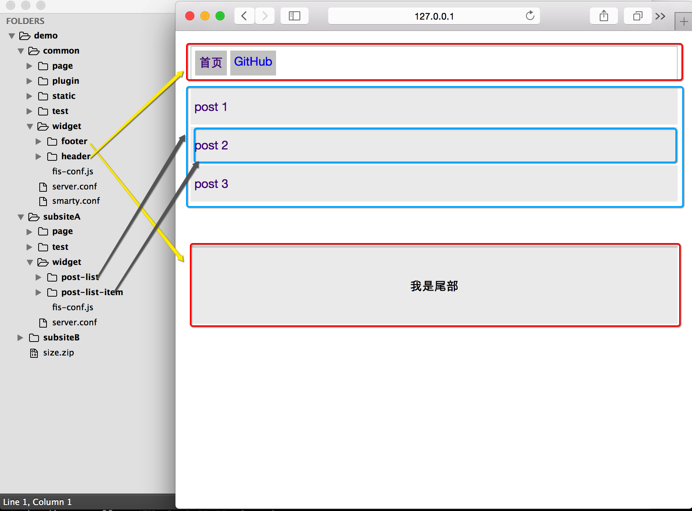

## 开发

主要介绍代码开发时 Smarty 解决方案提供的一些用法的使用。

### 模块化开发

FIS 把模板、js、css都纳入了模块化的范围，互相标记生成依赖树，统一做管理。而不像其他方案只针对于 js 做模块化处理。



如上图，Smarty 解决方案目录规范指定 `widget` 目录下的都是组件。为了表述更清晰一些，我们把组件分为 UI 组件 和 模板组件。

- UI 组件，不包含后端模板的组件
- 模板组件，包含后端模板的组件

每一个组件都**包含了它所有的依赖资源**，比如例子中的 `header` 组件，其包含 `header` 的模板、样式，当然如果有相关处理的脚本也会在这个里面，以功能划分。

对于模板组件，页面调用使用后端框架提供的 `widget` 模板接口。

```smarty

```

当模板解析时会解析对应的组件模板，并且把模板依赖的静态资源收集并插入页面，保证组件能正常工作。

对于 UI组件，包含 js 的组件，通过[前端模版化框架](#前端模块化框架)提供的接口进行调用。

```js
require('./a.js'); // 相对路径
require('/widget/ui/a.js'); // 相对于模板根目录的绝对路径。
require('common:widget/ui/a.js'); // 使用 ID 进行调用，跨模块调用时必须用 ID 调用
```

如果 UI 组件只包含 css 那么通过 FIS 提供的**声明依赖**内置语法进行使用。

- *js中*

    ```js
    // @require ./a.css
    ```

- *在 Smarty 中*

    ```smarty
    <!-- @require ./a.css -->
    ```

    或者由后端框架提供的 require 模板接口调用

    ```smarty
    
    ```

**同名依赖规则**

当一个模板，js、css （包括less、scss等）如果跟模板同名，那么就会给模板添加对同名js、css的依赖。同样如果一个 UI 组件，css 和 js 同名，也会给 js 添加同名 css 的依赖。

> 以上依赖都是同步依赖，所以当确定某个 js 要异步引入的时候，请不要跟模板同名。

----
NOTICE:

值得注意的是，假设一个组件，包含模板那么模板就是其调用入口，内部 js、css 不应该被独立引用；如果不包含模板而包含 js 和 css，js 为调用入口。
----


#### 前端模块化框架

模块化开发是所有项目解耦复用等的必要手段，但是前端界模块化框架却是争议最大的地方。比如 AMD 规范、国内的 CMD 规范、CommonJS 规范甚至于每个团队都有一套这样的前端模块化框架。

很不凑巧，Smarty 解决方案中使用的是一个自定义的前端模块化框架 [mod.js](https://github.com/fex-team/mod)，是为 FIS 量身定做的。

在推广 FIS 的过程中，这个模块化框架也给 FIS 的推广带来了不少麻烦。不过为了性能、为了能让用户快乐的开发，面对这些麻烦是值得的。

用法

```
/static/add.js
/static/a.js
/static/b.js
/index.tpl
```

- define
    
    *add.js*
    
    ```js
    define('static/add.js', function (require, exports, module) {
        module.exports = function (a, b) {
            return a + b;
        }
    });
    ```

    *a.js*

    ```js
    define('static/a.js', function (require, exports, module) {
        var add = require('static/add.js');
        console.log(add(1,1)); // 2
    })
    ```

    *b.js*

    ```js
    define('static/b.js', function (require, exports, module) {
        var add = require('static/add.js');
        console.log(add(1,2)); // 3
    })
    ```

- require

    *index.tpl*

    ```html
    <script type="text/javascript" src="/static/a.js"></script>
    <script>
        require('static/a.js');
    </script>
    ```

- require.async

    *index.tpl*

    ```html
    <script type="text/javascript">
    require.resourceMap({
        'res': {
            'static/b.js': {
                url: '/static/b.js'
            }
        }
    });
    </script>
    <script>
        require.async('static/b.js');
    </script>
    ```

跟其他模块化前端框架一样，`define` 一个组件并且 `require` 使用它。其中 `require.async` 是异步加载组件而`require`同步加载组件。

同步加载的组件**必须在组件执行之前进行加载**，`mod.js` 不负责加载同步使用的组件，由用户或者后端程序负责给页面添加 `<script src="..."><script>` 进行加载。

异步加载的组件，由 `mod.js` 负责加载，但具体组件的 `url` 由用户或者后端程序设置 `require.resourceMap` 确定。

对于 js 组件的执行，只需要 `define (id ...)` 后就可以直接通过 `require(id)` 或者 `require.async(id)` 来执行它。

不管是同步还是异步组件，都需要提前加载、设定好具体 url 才能被正确执行。这个跟其他模块化框架是不一样的。如 require.js，当 `require(['a'])` 时会先去请求这个资源，比如 `a.js` 然后运行时分析 `a.js` 的依赖，加载以来满足了后再执行 `a.js`。

**那么 `mod.js` 不就显得比较麻烦？**

前面提到过，mod.js 是配套 FIS 使用的。

0. 依赖由构建工具本地构建时解析好，并存入某个文件，Smarty 解决方案是存入 `map.json`
1. 运行时读取这个文件，并根据对应页面加载依赖
2. FIS 中依赖不光是 js 组件之间，模板、css 也可以相互依赖
3. 为了方便，构建工具可以对某些资源自动加 `define` 封装，以及自动生成一个 ID
4. FIS 构建后会给每个入表的文件自动生成一个 ID，用户可以通过这个 ID 获取到资源的 url、依赖、打包等信息

这样做的好处

0. 简化前端模块化框架逻辑，方便使用、运行时高效
1. css、js、模板统一纳入依赖管理，可以实现真正的模块化

依赖已经由构建工具生成，剩下就是解析依赖给页面添加资源，Smarty 解决方案通过后端程序解析 `map.json` 来拿到执行页面所有依赖的资源，并在页面返回给浏览器时替换到页面对应位置。我们把这套程序叫后端模块化框架。主要功能；

- 分析组件依赖，保持组件依赖顺序
- 同步使用组件在页面生成 `script`、`link` 让浏览器加载组件资源
- 异步组件生成 `require.resourceMap`
- 提供 `widget` 接口，可以加载整个模板组件


#### 构建工具的扩展

为了支持模块化开发，跟 `mod.js` 配合让组件中的 `.js` 能正确加载执行。在各个解决方案中需要根据选用的前端模块化框架的不同在工具层面做一些支持。

此块需要构建工具**分析依赖**，可能对前端模块化框架比较熟悉的同学知道，很多框架是运行时计算依赖，比如 require.js，但 FIS 中都是构建阶段就分析好了，把依赖写入**静态资源映射表**。

举例说明

```

```

#### 后端模块化框架

上面针对于 JS 组件化做了一下说明，依赖分析交给了后端框架。后端框架计算依赖直接读取分析**静态资源映射表**，由构建工具生成。


### 前端模板的使用

前端模板在 FIS 都是需要进行预编译的，预编译成可执行的 JS 代码。在 Smarty 解决方案中前端模板后缀一般是 `.tmpl`，使用时需要提前配置。

```js
fis.match('*.tmpl', {
    rExt: '.js',
    parser: fis.plugin('utc') // underscore 中的模板引擎
});
```

或者

```js
fis.match('*.tmpl', {
    rExt: '.js',
    parser: fis.plugin('bdtmpl') // baiduTemplate
});
```

> 你也可以选择自己喜欢的前端模板，安装对应 FIS 解析插件即可。

那么在 js 中使用前端模板，直接 `__inline` 对应模板即可。

```js

var tmpl = __inline('./view.tmpl');

console.log(tmpl(data)); // render 出 html 结果

```

### Smarty插件

介绍提供的 Smarty 插件的使用方法；

Smarty 解决方案通过 Smarty 插件的方式来做静态资源管理运算以及一些转义操作。

```
block.widget_inline.php
compiler.body.php
compiler.head.php
compiler.html.php
compiler.placeholder.php
compiler.require.php
compiler.script.php
compiler.style.php
compiler.uri.php
compiler.widget.php
function.http_header.php
modifier.f_escape_callback.php
modifier.f_escape_data.php
modifier.f_escape_event.php
modifier.f_escape_js.php
modifier.f_escape_path.php
modifier.f_escape_xml.php
```

#### html

替换 `html` 标签，**必须**

```smarty



```

定义属性：

- `framework` 设置 mod.js 的 ID，为了确认哪个文件是模块化框架
    
    ```smarty
    
        ...
    
    ```

#### head

替换 `head` 标签，**必须**

用来标记 `</head>` 的位置，最终计算收集到的 css 会替换到 `</head>` 前。

```smarty

    <title></title>

```

#### body

替换 `body` 标签，**必须**

标记 `</body>` 的位置，最终计算收集的 js 以及内嵌 script 替换到 `</body>` 后。

```smarty

    <div>
    ...
    </div>

```

如果需要给body开始标签添加属性，通过以下方式。

```smarty

    ...

```

#### script

替换 `script` 标签，**非必须**

如果内嵌资源中引用了（`require`）某个组件化 js ，就必须放到此标签内；此标签内的 js 最后会收集起来统一放置到 `</body>` 后。

如果有些内嵌脚本，如统计脚本，不想被收集到最后面，直接使用原生标签即可。

```smarty

var c = require('/widget/ui/a/a.js');

```

#### style

替换 `style` 标签，**非必须**

收集内嵌的 css 资源到 `</head>` 前，但在所有 link 资源后，这个顺序需要特别注意一下。收集内嵌 css 资源到同一个 `style` 标签下有助于页面渲染性能。

如果不想被收集，使用原生标签即可。

```smarty

body {
    background-color: #CCCCCC;
}

```

#### require

模板层面的资源加载接口，如果使用原生 `link` 或者 `script` 引用资源不会被收集起来放到 `</body>` 标签后面，所以就有了这个接口。

支持 js、css 等资源，支持对外部链接。

**此接口可以加载任意资源，不需要非得是组件化资源，但只是告诉后端框架你需要加载哪些资源，最终的结果是资源只会被加载，包括其依赖。如果是 js 组件，并不会由于调用这个接口直接触发执行组件逻辑**

```smarty

```

- name 参数为 ID

    ID = <模块名>:<资源相对于模块根目录的路径>

    ```
    /common/a.js  => id = common:a.js
    /common/static/b.js => id = common:static/b.js  
    ```


```smarty

```

- src 外部资源的 url
    
    如果不以 `.js`、`.css` 结尾，需要设置属性 type 指明具体类型。

- type 非必须，当引入资源不已 `.js`、`.css` 结尾时使用。值 `js` 或者 `css`

    ```smarty
    
    ```

#### uri

动态获得某个路径的最终 `url`。

由于 FIS 构建时会根据配置给资源添加 cdn、md5戳，这个给编码带来了一些麻烦。`uri` 接口可以动态获取资源的最终 `url`

```
{%$logo_url=""%}
```

- name 资源的 ID

**注意** `require` 和 `uri` 处理的资源必须在 **静态资源映射表** 中有记录，如果没有记录无法正常工作。


#### widget

FIS 模块化组件加载接口，加载某个模板并收集模板依赖的所有静态资源。

```smarty

```

- name tpl 的 ID

**widget** 局部变量

```smarty

```

如上，`$data.header.info` 被赋值给 `info` 属性，`info` 属性可以直接在模板中被取值，而修改 `$info` 不会对 `$data.header.info` 造成影响。

*header.tpl*
```smarty

```
